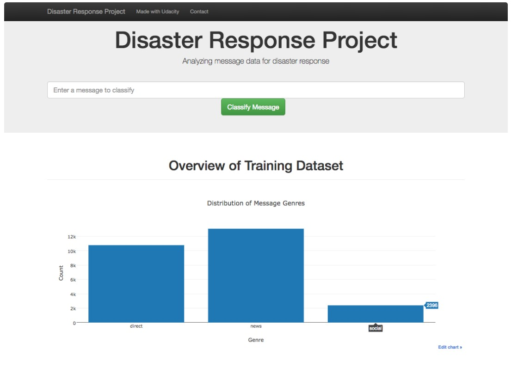
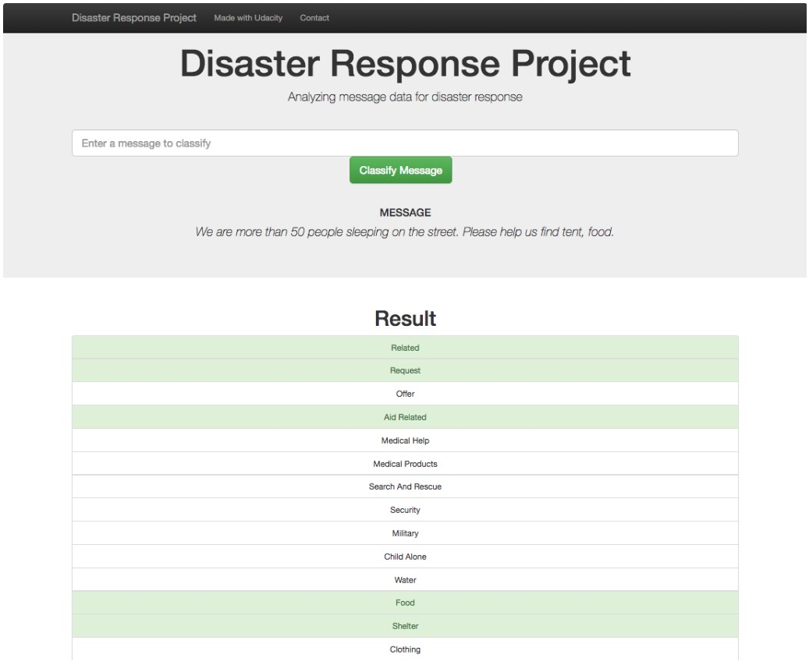

# Disaster Response Web App


## Project Overveiw:
In this project, we are using data set data from [Appen](https://appen.com) (formally Figure 8) containing real messages that were sent during disaster events. We create an ETL pipeline as well as a machine learning pipeline to categorize these events so that we can send the messages to an appropriate disaster relief agency.

The project includes a web app where an emergency worker can input a new message and get classification results in several categories. The web app also has three visualizations of the data.

Below are a few screenshots of the web app:



----

## File Structure:
```
- app
| - template
| |- master.html  # main page of web app
| |- go.html  # classification result page of web app
|- run.py  # Flask file that runs app

- data
|- disaster_categories.csv  # data to process 
|- disaster_messages.csv  # data to process
|- process_data.py
|- InsertDatabaseName.db   # database to save clean data to

- models
|- train_classifier.py
|- classifier.pkl  # saved model 

- README.md
```
----
## Getting Started:

### Project Components:

**1. ETL Pipeline**<br>
The Python script, `process_data.py`, implements data cleaning pipeline that:

- Loads the messages and categories datasets
- Merges the two datasets
- Cleans the data
- Stores it in a SQLite database

**2. ML Pipeline**<br>
The Python script, `train_classifier.py`, includes machine learning pipeline that:

- Loads data from the SQLite database
- Splits the dataset into training and test sets
- Builds a text processing and machine learning pipeline
- Trains and tunes a model using GridSearchCV
- Outputs results on the test set
- Exports the final model as a pickle file

**3. Flask Web App**<br>
A flask web app that:

- Displays three data visualization using Plotly
- Recieves text message and show the result for each category

----

### Instructions:
1. Run the following commands in the project's root directory to set up your database and model.

    - To run ETL pipeline that cleans data and stores in database

        ```bash
        python data/process_data.py data/disaster_messages.csv data/disaster_categories.csv data/DisasterResponse.db
        ```

    - To run ML and NLP pipeline that trains classifier and saves it as a pickle file
    
        ```bash
        python models/train_classifier.py data/DisasterResponse.db models/classifier.pkl
        ```

2. Run the Flask webapp on local host: 
    ```bash
    python app/run.py
    ```

3. Go to http://0.0.0.0:3000/
